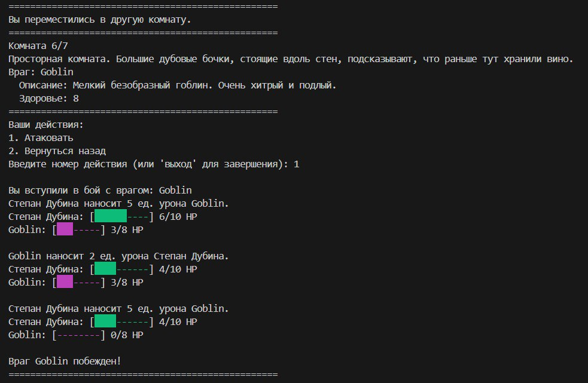

# RPG Quest

Текстовая консольная RPG-игра, созданная для демонстрации навыков разработки и тестирования Python-приложений.  
Проект является тестовым заданием для **LESTA GAMES**.

---

## Описание

Игра представляет собой пошаговую текстовую RPG, в которой игрок перемещается по подземелью, сражается с врагами и пытается выжить.

Проект реализован на Python 3.11.9 с использованием стандартной библиотеки.  
Для тестирования используется `pytest`.

---

## Установка и запуск

### Локальная установка

1. **Клонируйте проект с GitHub:**
   ```bash
   git clone git@github.com:Grigoriev1991/RPG-Quest.git
   ```

2. **Создайте виртуальное окружение:**
   ```bash
   python -m venv venv
   source venv/bin/activate   # Для Linux/MacOS
   venv\Scripts\activate    # Для Windows
   ```

3. **Установите зависимости:**
   ```bash
   pip install -r requirements.txt
   ```

4. **Запуск игры:**
   ```bash
   python -m main game
   ```

5. **Запуск тестов:**
   ```bash
   python -m main test
   ```

---

### Использование Docker

1. **Скачайте образ:**
   ```bash
   docker pull grigoriev1991/rpg-game:latest
   ```

2. **Запустите игру:**
   ```bash
   docker run --rm -it grigoriev1991/rpg-game game
   ```

3. **Запустите тесты:**
   ```bash
   docker run --rm grigoriev1991/rpg-game test
   ```

---

## Возможности

- Перемещение по комнатам подземелья.
- Сражения с врагами.
- Автобой с использованием оружия и брони.
- Интерактивный ввод действий игрока.
- Автоматические тесты для проверки функционала.

---

## Пример игрового процесса



---

## Автор
 
Автор: [Grigoriev1991](https://t.me/Grigoriev1991)
